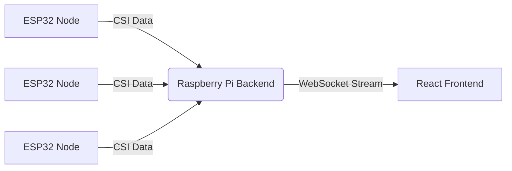

# InviSense System

**ESP32 Movement Monitoring System for Elderly Care**

A comprehensive solution for real-time monitoring of elderly movement patterns using WiFi Channel State Information (CSI). The system leverages existing WiFi infrastructure to detect motion without intrusive cameras or wearables, visualizing data on a modern React dashboard.

## 🚀 Components

This repository organizes the InviSense ecosystem into three main components:

### 1. Firmware (`/espectre`)
**Target:** ESP32 / ESP32-S3 / ESP32-C3 / ESP32-C6
The low-level firmware responsible for collecting CSI (Channel State Information) data from WiFi signals. It processes raw signal data and publishes movement metrics.

### 2. Backend (`/InviSense`)
**Stack:** Python, FastAPI, WebSockets
**Target:** Raspberry Pi
The central server that acts as the bridge between the hardware sensors and the user interface. It aggregates data from multiple ESP32 nodes via MQTT/WebSockets and streams processed metrics to the frontend.

### 3. Frontend (`/pixel-perfect`)
**Stack:** React, TypeScript, Vite, Tailwind CSS
**Target:** Browser (Single Page Application)
A responsive web application, often referred to as the **InviSense System Dashboard**, providing real-time visualization of movement data.
*   **Hardware View:** Technical overview with signal strength (RSSI) and packet rates.
*   **Home View:** Interactive drag-and-drop map of the living space.
*   **Overview:** High-level status dashboard with threshold alerts.

## 🌟 Key Features

*   **Non-Intrusive Monitoring:** Uses WiFi signals to detect presence and movement.
*   **Real-Time Visualization:** Sub-second updates for movement scores and signal quality.
*   **Customizable Alerts:** User-defined thresholds for movement detection per node.
*   **Interactive Layouts:** Drag-and-drop interface to map sensor locations to the physical room layout.
*   **Privacy-First:** No cameras or microphones; purely signal-based detection.

## 🛠️ Architecture

*   **Data Flow:** ESP32 devices publish movement scores, RSSI, and packet rates.
*   **Processing:** The FastAPI backend normalizes and streams this data via WebSockets (`ws://<ip>/ws`).
*   **Display:** The React app consumes the stream to update charts, heatmaps, and status indicators in real-time.

## 📦 Getting Started

To get the full system up and running, you will need to set up each component. Please refer to the README files in each subdirectory for detailed instructions.

*   [Firmware Setup](./espectre/README.md)
*   [Backend Setup](./InviSense/README.md)
*   [Frontend Setup](./pixel-perfect/README.md)

## 📄 License

This project is licensed under the terms found in the [LICENSE](LICENSE) file.
